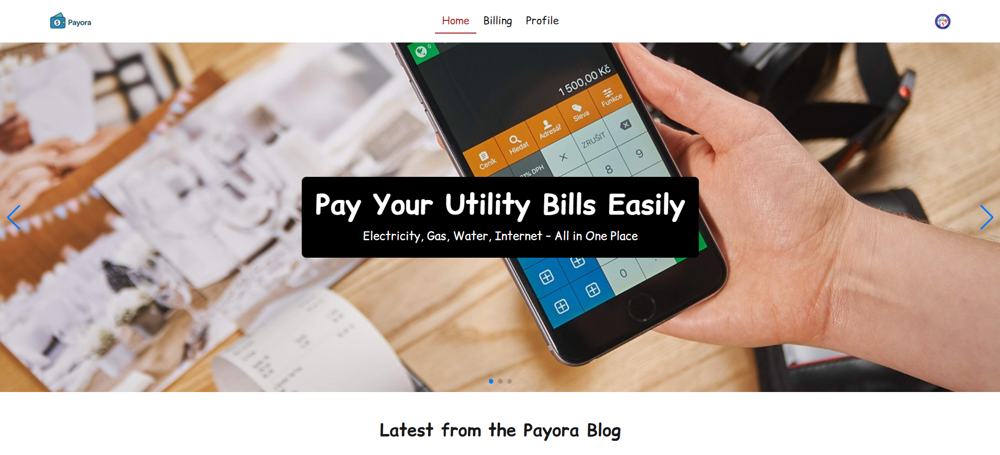

# 💳 Payora – Smart Bills, Simple Pay

**Payora** is a modern, winter-themed utility bill management web application that allows users to easily view and pay their utility bills using their available balance. Designed with a focus on simplicity and local usability, Payora ensures a smooth and secure experience for managing electricity, water, gas, internet, and more.

---

## 🔗 Live Website

🌐 [Visit Payora Live](https://payora-9cfe0.web.app/)

---

## 🧩 Key Features

- 🔐 **Firebase Authentication**
  - Email & Password login
  - Google social login
  - Route protection and redirect after login

- 💸 **Bill Payment System**
  - View all types of utility bills (electricity, gas, water, internet, etc.)
  - Pay bills using your balance (default: 10,000 BDT)
  - Prevents multiple payments for the same bill

- 👤 **User Profile**
  - View and update display name and photo
  - View email and current balance

- 📊 **Bill Filter and Detail View**
  - Filter bills by type (dropdown)
  - View detailed info and pay from balance

- ❄️ **Unique Winter-Themed UI**
  - Local design inspiration
  - Tailwind CSS with cool tones (blue, teal, white)

- 🧠 **SPA Experience**
  - Built with React Router DOM
  - Page reload on routes handled for Netlify/Firebase

---

## 🔧 Tech Stack

- **React**
- **React Router DOM**
- **Firebase Authentication**
- **Tailwind CSS**
- **SwiperJS (for Carousel/Slider)**
- **Toastify (for Notifications)**
- **Environment Variables for Security**

---

## 📁 Folder Structure Overview

```bash
payora/
├── public/
│   └── favicon.ico
├── src/
│   ├── assets/               # images, icons, logos
│   ├── components/           # reusable components (e.g., Navbar, Footer)
│   ├── context/              # AuthContext, BalanceContext, etc.
│   ├── hooks/                # custom React hooks
│   ├── layout/               # Main Layout with <Navbar/> <Footer/>
│   ├── pages/
│   │   ├── Home/
│   │   ├── Login/
│   │   ├── Register/
│   │   ├── Bills/
│   │   ├── BillDetails/
│   │   ├── Profile/
│   │   ├── UpdateProfile/
│   ├── routes/
│   │   └── PrivateRoute.jsx
│   ├── data/                 # JSON for bills, cards, etc.
│   ├── firebase/             # firebase.init.js and config
│   ├── App.jsx
│   ├── main.jsx
│   └── index.css
├── .env                     # environment variables (Firebase keys, etc.)
├── .gitignore
├── package.json
└── README.md

```

# 🛠 How to Run Locally


###  Clone the repo:
```bash
git clone https://github.com/your-username/payora.git
```


### Install dependencies:

```bash
npm install
```
### Add your Firebase config to a .env file:

```env
VITE_API_KEY=your_key
VITE_AUTH_DOMAIN=your_domain
```
### Run the development server:

```bash
npm run dev
```
# 📦 NPM Packages Used
- @heroicons/react  
- @tailwindcss/vite  
- firebase  
- react  
- react-countup  
- react-dom  
- react-firebase-hooks  
- react-icons  
- react-router  
- sweetalert2  
- swiper  
- tailwindcss 

# ✅ Deployment Info
If Deployed via Netlify. Firebase authorized domains updated to avoid redirect issues on reload.

## 🔒 Protected Routes
* /billing

* /billing/:id

* /profile

* /profile/edit

These routes are only accessible when the user is logged in.

# 📸 Screenshots



# 📜 License
MIT License – free to use for educational projects.

# 🙌 Credits
Developed with ❤️ by Jashedul Islan Shaun

🌐 [GitHub](https://github.com/shauncuier)
